# MASTER PLAN: SaaS POS Bengkel & Retail (High Performance)

**Version:** 1.0  
**Architecture:** Cloud-Native, Multi-Tenant, Full Online (Direct-to-Server)  
**Core Philosophy:** Single Source of Truth, Low Latency, Scalable.

---

## 1. Executive Summary

Membangun platform Point of Sale (POS) berbasis SaaS (*Software as a Service*) yang dikhususkan untuk manajemen bengkel multi-cabang. Sistem ini dirancang **Full Online** tanpa database lokal di sisi klien (HP/Tablet) untuk menjamin integritas data 100%. Kecepatan aplikasi ditopang oleh strategi *Caching* agresif di sisi server.

**Target Pengguna:**
1. **Superadmin:** Pengelola Platform SaaS.
2. **Tenant Owner:** Pemilik Bengkel (Bisa memiliki banyak cabang).
3. **Branch Manager:** Kepala Cabang.
4. **Cashier:** Staf Kasir (Tablet/HP).

> [!NOTE]
> **Mekanik tidak memiliki akun sistem.** Mekanik hanya dicatat sebagai data master untuk keperluan pencatatan komisi. Kasir langsung berkomunikasi dengan mekanik secara lisan.

---

## 2. Technology Stack (The "Speed" Engine)

Pemilihan teknologi difokuskan pada kecepatan respon server (< 100ms) dan skalabilitas data.

| Komponen | Teknologi | Keterangan |
| :--- | :--- | :--- |
| **Mobile App** | **Flutter** | Single codebase (Android/iOS). Berfungsi sebagai *Thin Client* (UI Only, Logic di Server). |
| **Web Dashboard** | **Next.js (React)** | Server-Side Rendering untuk dashboard owner yang cepat dan SEO friendly (Landing Page). |
| **Backend API** | **Node.js (NestJS)** | Framework TypeScript yang modular, scalable, dan maintainable. |
| **Database Utama** | **PostgreSQL 16** | RDBMS untuk menyimpan data transaksional, stok, dan laporan keuangan dengan integritas tinggi (ACID). |
| **Caching Layer** | **Redis** | **CRITICAL:** Menyimpan data produk, sesi user, dan stok sementara di RAM untuk respon scan barcode instan. |
| **Infra/Cloud** | **GCP / AWS (Jakarta)** | Wajib Region Jakarta (ap-southeast-3) untuk meminimalisir *latency*. |
| **Barcode Scan** | **ML Kit / Mobile Scanner** | Library Flutter untuk scanning ultra-cepat menggunakan kamera HP. |

---

## 3. System Architecture Diagram


---

## 4. Database Schema Strategy (Multi-Tenant)

Pola **Shared Database, Isolated Schema**. Setiap tabel wajib memiliki kolom `tenant_id` yang di-index.

### Core Tables

```sql
-- 1. TENANTS (Penyewa SaaS)
CREATE TABLE tenants (
    id UUID PRIMARY KEY,
    business_name VARCHAR(100),
    subscription_plan VARCHAR(20), -- 'LITE', 'PRO', 'ENTERPRISE'
    is_active BOOLEAN DEFAULT true, -- Untuk blokir jika telat bayar
    created_at TIMESTAMP DEFAULT NOW()
);

-- 2. USERS (Tanpa Mekanik - Mekanik adalah data master terpisah)
CREATE TABLE users (
    id UUID PRIMARY KEY,
    tenant_id UUID REFERENCES tenants(id),
    branch_id UUID, -- Nullable (Owner bisa lihat semua)
    username VARCHAR(50),
    password_hash TEXT,
    role VARCHAR(20), -- 'OWNER', 'MANAGER', 'CASHIER'
    last_login TIMESTAMP
);

-- 2b. MECHANICS (Data Master Mekanik - Tanpa Login)
CREATE TABLE mechanics (
    id UUID PRIMARY KEY,
    tenant_id UUID REFERENCES tenants(id),
    branch_id UUID,
    name VARCHAR(100),
    phone VARCHAR(20),
    is_active BOOLEAN DEFAULT true,
    created_at TIMESTAMP DEFAULT NOW()
);

-- 3. PRODUCTS (Barang & Jasa)
CREATE TABLE products (
    id UUID PRIMARY KEY,
    tenant_id UUID REFERENCES tenants(id),
    sku VARCHAR(50), -- Barcode
    name VARCHAR(200),
    type VARCHAR(10), -- 'GOODS', 'SERVICE'
    base_price DECIMAL(15, 2), -- Harga modal
    sell_price DECIMAL(15, 2), -- Harga jual (untuk barang), NULL untuk jasa fleksibel
    is_flexible_price BOOLEAN DEFAULT false, -- TRUE jika harga diinput manual saat transaksi
    image_url TEXT
);

-- Indexing untuk kecepatan scan
CREATE INDEX idx_products_sku_tenant ON products(tenant_id, sku);

-- 4. INVENTORY (Stok per Cabang)
CREATE TABLE inventory (
    id UUID PRIMARY KEY,
    tenant_id UUID REFERENCES tenants(id),
    branch_id UUID,
    product_id UUID REFERENCES products(id),
    qty INT DEFAULT 0,
    min_stock_alert INT DEFAULT 5
);

-- 5. TRANSACTIONS (Header & Detail)
CREATE TABLE transaction_headers (
    id UUID PRIMARY KEY,
    tenant_id UUID,
    branch_id UUID,
    customer_plate VARCHAR(20),
    total_amount DECIMAL(15, 2),
    status VARCHAR(20), -- 'PENDING', 'PAID', 'CANCELLED'
    created_at TIMESTAMP DEFAULT NOW()
);

CREATE TABLE transaction_details (
    id UUID PRIMARY KEY,
    transaction_id UUID REFERENCES transaction_headers(id),
    product_id UUID,
    mechanic_id UUID REFERENCES mechanics(id), -- Mekanik yang mengerjakan (dari data master)
    qty INT,
    price_at_moment DECIMAL(15, 2), -- Harga saat transaksi (bisa diinput manual untuk jasa fleksibel)
    mechanic_fee DECIMAL(15, 2), -- Komisi mekanik untuk item ini (diinput manual)
    subtotal DECIMAL(15, 2)
);
```

---

## 5. Key Workflows (Alur Kerja Utama)

### A. Scanning Barang (The "Redis-First" Strategy)

**Goal:** Respon di bawah 100ms tanpa Local DB.

1. **Flutter:** Kasir scan barcode `12345`. App kirim `GET /api/products/scan/12345`.
2. **Node.js:** Cek Redis Key: `tenant:{id}:product:{12345}`.
   - **Scenario Hit:** Data ditemukan. Return JSON langsung. *(Waktu: ~5ms)*.
   - **Scenario Miss:** Query ke PostgreSQL → Simpan ke Redis (TTL 1 Jam) → Return JSON. *(Waktu: ~50ms)*.
3. **Flutter:** Tampilkan data produk + tombol "Add to Cart".

### B. Transaksi dengan Jasa Fleksibel

**Goal:** Kasir dapat menginput harga jasa secara fleksibel sesuai tingkat kesulitan pekerjaan.

1. **Flutter (Kasir):** Buat Order baru, input plat nomor pelanggan.
2. **Flutter (Kasir):** Pilih jasa (misal: "Servis Ringan"). Karena `is_flexible_price = true`, muncul input manual:
   - **Harga Jasa:** Rp XXX (diinput berdasarkan kesepakatan dengan pelanggan)
   - **Nama Mekanik:** Pilih dari dropdown data master mekanik
   - **Fee Mekanik:** Rp XXX (diinput berdasarkan berat pekerjaan)
3. **Node.js:**
   - Insert `transaction_header` & `detail` dengan harga dan fee yang diinput.
   - Kurangi stok di `inventory` jika ada sparepart.
4. **Kasir:** Komunikasi langsung dengan mekanik secara lisan untuk penugasan.

### C. Dashboard Owner (Monitoring)

1. **Next.js:** Owner login.
2. **Node.js:** Melakukan query agregasi berat di PostgreSQL (misal: Total Omzet Bulan Ini).
3. **Optimization:** Hasil query disimpan di Redis dengan durasi pendek (misal 5 menit) agar dashboard tidak membebani database jika di-refresh terus menerus.

---

## 6. Mobile App Specifications (Flutter)

Karena tidak ada database lokal, UX harus dimaksimalkan untuk menangani network latency.

- **Skeleton Loading:** Tampilkan kerangka abu-abu saat menunggu respon server (jangan spinner biasa).
- **Optimistic UI:** Saat klik "Tambah ke Keranjang", UI langsung update seolah-olah sukses, baru kirim request ke server di background. Jika gagal, rollback UI dan beri pesan error.
- **Error Handling:**
  - **Timeout:** Jika request > 5 detik, munculkan *"Koneksi Tidak Stabil, Coba Lagi"*.
  - **Retry:** Auto-retry 3x untuk request GET (baca data).
- **Camera Scanner:** Mode **Continuous Scan** (Scan → Beep → Scan lagi) tanpa menutup kamera.

---

## 7. Security & SaaS Management

- **Tenant Isolation (Middleware):** Setiap request wajib membawa Header `Authorization: Bearer <JWT>`. Middleware Node.js akan men-decode JWT, mengambil `tenant_id`, dan menyuntikkannya ke setiap Query Database secara otomatis.
- **Subscription Enforcer:** Middleware mengecek status `is_active` di tabel `Tenants`. Jika `false`, tolak semua request transaksi (Read-Only Mode).
- **Role Guard:** Kasir tidak boleh hit API `DELETE /products`. Hanya Owner/Manager yang boleh akses `GET /financial-reports`.

---

## 8. Development Phases (Roadmap)

### Phase 1: Foundation (Minggu 1-4)
- [ ] **[Backend]** Setup NestJS, PostgreSQL, Redis.
- [ ] **[Backend]** Implementasi Auth (JWT) & Tenant Isolation Middleware.
- [ ] **[Backend]** CRUD Master Data (Produk, User, Cabang).
- [ ] **[Mobile]** Setup Flutter Project, State Management, & Login Screen.

### Phase 2: Core POS & Redis Integration (Minggu 5-8)
- [ ] **[Backend]** Implementasi Logika Scan dengan Redis Caching.
- [ ] **[Mobile]** Fitur Camera Scanner & Cart System.
- [ ] **[Mobile]** Checkout Flow (Simpan Transaksi ke Server).
- [ ] **[Backend]** Pengurangan Stok Real-time.

### Phase 3: Mechanic & Commission System (Minggu 9-10)
- [ ] **[Backend]** CRUD Data Master Mekanik.
- [ ] **[Mobile]** UI Input Harga Jasa Fleksibel.
- [ ] **[Backend]** Logika pencatatan komisi mekanik per transaksi.
- [ ] **[Backend]** Laporan rekap komisi mekanik bulanan.

### Phase 4: Web Dashboard & Reporting (Minggu 11-13)
- [ ] **[Web]** Setup Next.js Dashboard.
- [ ] **[Web]** Halaman Laporan (Omzet, Stok, Terlaris).
- [ ] **[Backend]** Query Analitik Kompleks (SQL Aggregation).

### Phase 5: SaaS Billing & Launch (Minggu 14-16)
- [ ] **[Web]** Integrasi Payment Gateway (Midtrans/Xendit) untuk bayar langganan.
- [ ] **[System]** Load Testing (Uji beban ribuan request scan per detik).
- [ ] **[Deployment]** Setup CI/CD ke Cloud Server.

---

## 9. API Endpoints Overview

| Method | Endpoint | Fungsi | Role Akses |
| :--- | :--- | :--- | :--- |
| `POST` | `/auth/login` | Login User & Return JWT | Public |
| `GET` | `/products/scan/:sku` | High Speed Scan Produk (Redis) | Kasir |
| `GET` | `/mechanics` | List data master mekanik | Kasir |
| `POST` | `/transactions` | Buat transaksi baru (dengan harga & fee fleksibel) | Kasir |
| `GET` | `/reports/daily` | Laporan omzet harian | Owner |
| `GET` | `/reports/mechanic-commission` | Rekap komisi mekanik | Owner, Manager |
| `POST` | `/admin/subscription/pay` | Bayar perpanjangan SaaS | Owner |

---

## 10. Fitur Lengkap (Berdasarkan Deskripsi Bisnis)

### 10.1 Fitur Untuk Pemilik Bisnis (Owner)

| Fitur | Deskripsi |
| :--- | :--- |
| Dashboard "Live" Omzet | Melihat total pendapatan kotor, laba bersih, dan jumlah transaksi real-time |
| Laporan Laba Rugi Otomatis | Sistem menghitung: Total Penjualan - Modal Barang - Komisi Mekanik = Laba Bersih |
| Analisis Performa Cabang | Bandingkan cabang mana yang paling ramai |
| Kontrol Stok Pusat | Melihat sisa stok di setiap gudang cabang |
| Manajemen Hak Akses | Mengatur role dan permission user |

### 10.2 Fitur Operasional Kasir (Front Office)

| Fitur | Deskripsi |
| :--- | :--- |
| Scan Barcode Lewat Kamera | Mode scan terus-menerus untuk kecepatan tinggi |
| Transaksi Gabungan | Satu struk berisi sparepart + jasa pasang |
| Pencarian Cepat | Cari barang/jasa dengan 3 huruf, hasil muncul seketika |
| Struk Digital & Cetak | Print bluetooth atau kirim ke WhatsApp |
| Pembayaran Multi-Metode | Tunai, Transfer, QRIS, Kartu Debit |

### 10.3 Fitur Manajemen Servis & Mekanik

> [!IMPORTANT]
> **Mekanik tidak memiliki akun.** Kasir berkomunikasi langsung dengan mekanik secara lisan.

| Fitur | Deskripsi |
| :--- | :--- |
| Data Master Mekanik | Daftar nama mekanik untuk pencatatan komisi |
| Harga Jasa Fleksibel | Kasir input harga jasa manual sesuai berat pekerjaan |
| Input Komisi Manual | Kasir input fee mekanik per item jasa saat transaksi |
| Rekap Komisi Bulanan | Laporan total komisi per mekanik setiap bulan |
| Riwayat Kendaraan | Rekam medis berdasarkan plat nomor |

### 10.4 Fitur Manajemen Inventaris (Gudang)

| Fitur | Deskripsi |
| :--- | :--- |
| Mutasi Stok Antar Cabang | Transfer barang antar cabang tercatat rapi |
| Stok Opname Pakai HP | Scan barang, sistem hitung selisih & kerugian |
| Peringatan Stok Menipis | Notifikasi otomatis di bawah batas minimum |

### 10.5 Fitur Manajemen Pelanggan (CRM)

| Fitur | Deskripsi |
| :--- | :--- |
| Database Pelanggan | Nama, No HP, Data Kendaraan |
| Pengingat Servis Berkala | Pesan otomatis saat waktunya servis |

---

## 11. Ringkasan Alur Kerja Aplikasi

```mermaid
flowchart LR
    A[👤 Pelanggan Datang] --> B[📱 Kasir Input Plat Nomor]
    B --> C[🛒 Pilih Jasa & Sparepart]
    C --> D[� Kasir Tanya Mekanik - Berapa Harga?]
    D --> E[� Input Harga Jasa & Fee Mekanik]
    E --> F[🔧 Mekanik Kerjakan Servis]
    F --> G[💰 Kasir Terima Pembayaran]
    G --> H[🧾 Cetak/Kirim Struk]
    H --> I[📊 Owner Lihat Dashboard & Rekap Komisi]
```



---

> **Dokumen ini merupakan panduan lengkap pengembangan aplikasi RingPOS.**  
> *Last Updated: Februari 2026*